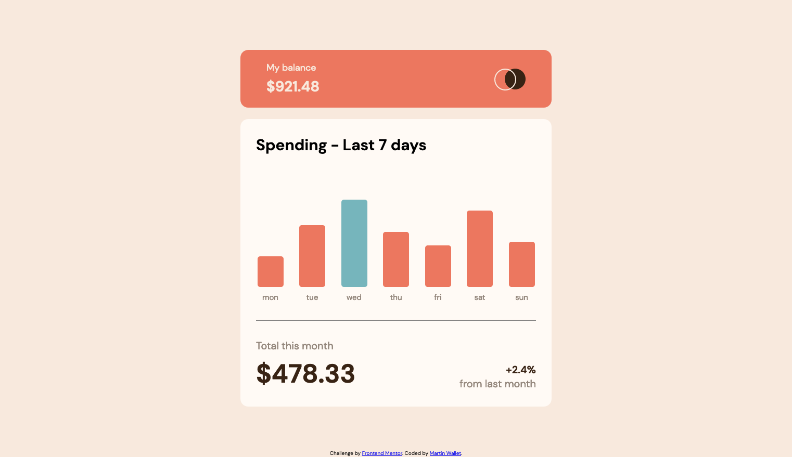

# Frontend Mentor - Expenses chart component solution

This is a solution to the [Expenses chart component challenge on Frontend Mentor](https://www.frontendmentor.io/challenges/expenses-chart-component-e7yJBUdjwt). Frontend Mentor challenges help you improve your coding skills by building realistic projects.

## Table of contents

- [Overview](#overview)
  - [The challenge](#the-challenge)
  - [Screenshot](#screenshot)
  - [Links](#links)
- [My process](#my-process)
  - [Built with](#built-with)
  - [What I learned](#what-i-learned)
  - [Continued development](#continued-development)
  - [Useful resources](#useful-resources)
- [Author](#author)

## Overview

### The challenge

Users should be able to:

- View the bar chart and hover over the individual bars to see the correct amounts for each day
- See the current day’s bar highlighted in a different colour to the other bars
- View the optimal layout for the content depending on their device’s screen size
- See hover states for all interactive elements on the page
- **Bonus**: Use the JSON data file provided to dynamically size the bars on the chart

### Screenshot



### Links

- Solution URL: [GitHub](https://github.com/martinw0/expenses-chart)
- Live Site URL: [GitHub Pages](https://martinw0.github.io/expenses-chart/)

## My process

### Built with

- Semantic HTML5 markup
- CSS custom properties
- Flexbox
- Mobile-first workflow
- SASS

### What I learned

How to edit another element from hover element:

```html
<div id="a">Div A</div>
<div id="b">Div B</div>
```

```css
#a:hover + #b {
    background: #ccc
}
```

[jsfiddle](https://jsfiddle.net/u7tYE/)

clientHeight includes padding.

offsetHeight includes padding, scrollBar and borders.

How can I read local JSON file with fetch function in javascript?
```js
readJson () {
   // http://localhost:8080
   fetch('/Reading/api/file')
   .then(response => {
       if (!response.ok) {
           throw new Error("HTTP error " + response.status);
       }
       return response.json();
   })
   .then(json => {
       this.users = json;
       //console.log(this.users);
   })
   .catch(function () {
       this.dataError = true;
   })
}
```

How to get the full height including margin
```js
var elHeight = el.offsetHeight;
elHeight += parseInt(window.getComputedStyle(el).getPropertyValue('margin-top'));
elHeight += parseInt(window.getComputedStyle(el).getPropertyValue('margin-bottom'));
```

How to create a list with the value of key in an array of objects:
```js
var nameArray = students.map(function (el) { return el.name; });
```

### Continued development

### Useful resources

[How TO - Tooltip](https://www.w3schools.com/howto/howto_css_tooltip.asp)
[Get height of element](https://www.techiedelight.com/get-height-of-div-element-javascript/)
[JS - height property](https://www.techiedelight.com/get-height-of-div-element-javascript/)
[Changing HTML content with JS](https://www.w3schools.com/js/js_htmldom_html.asp)

## Author

- Frontend Mentor - [@martinw0](https://www.frontendmentor.io/profile/martinw0)
- Twitter - [@LeWalletM](https://www.twitter.com/LeWalletM)
